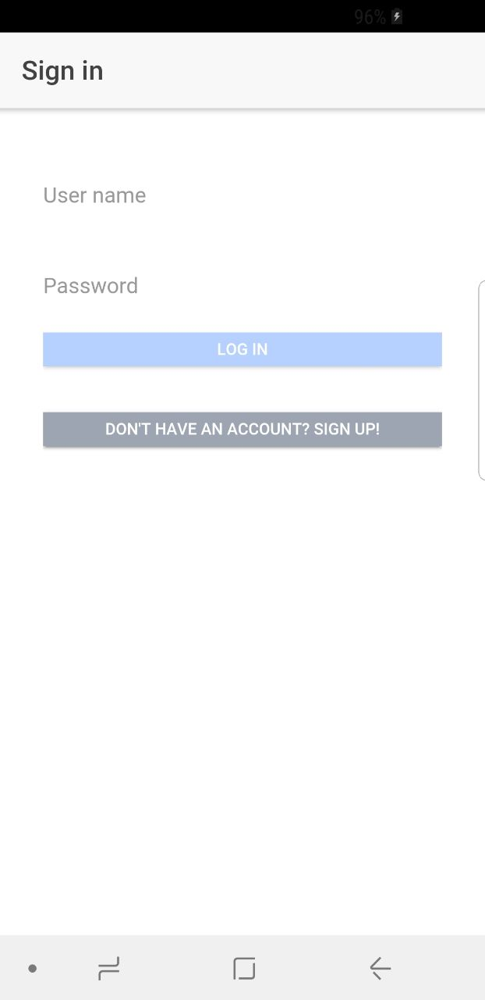
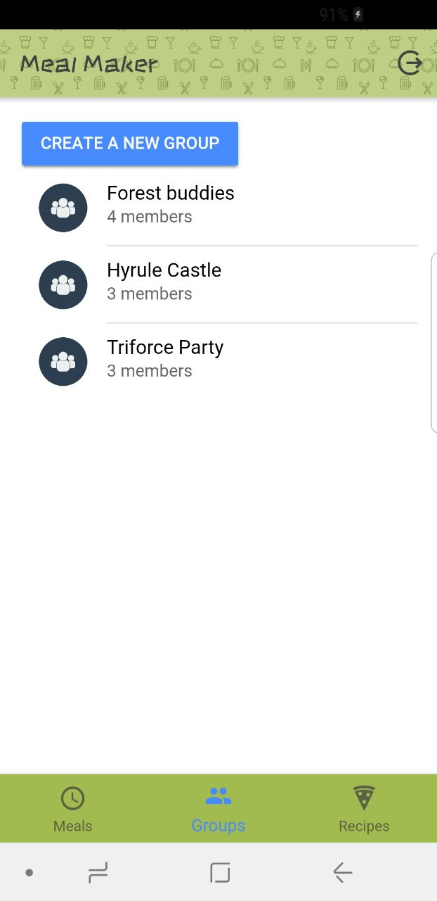
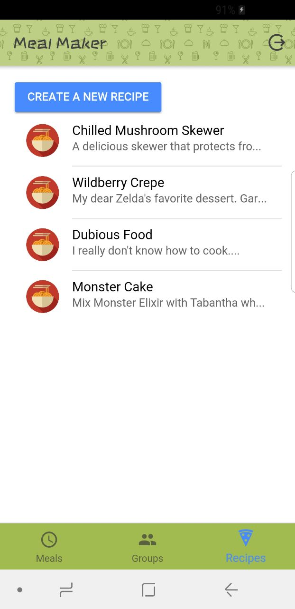
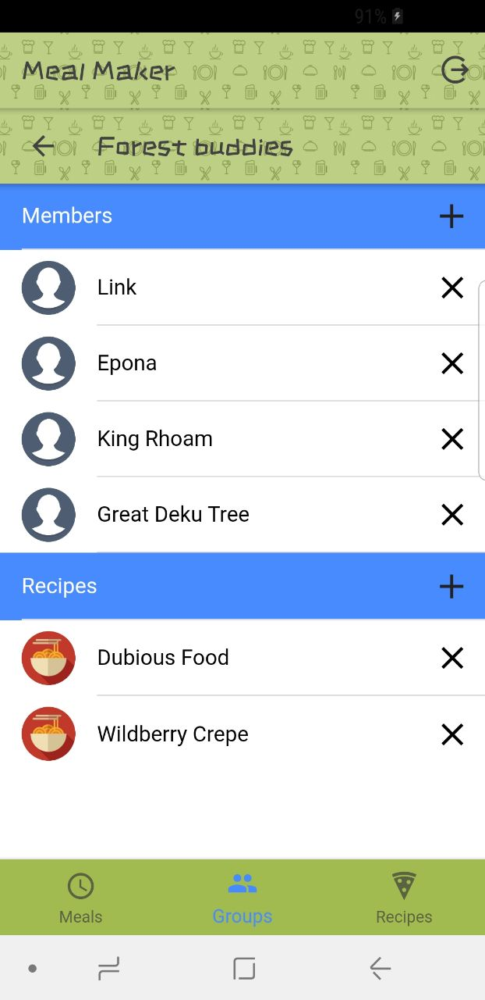
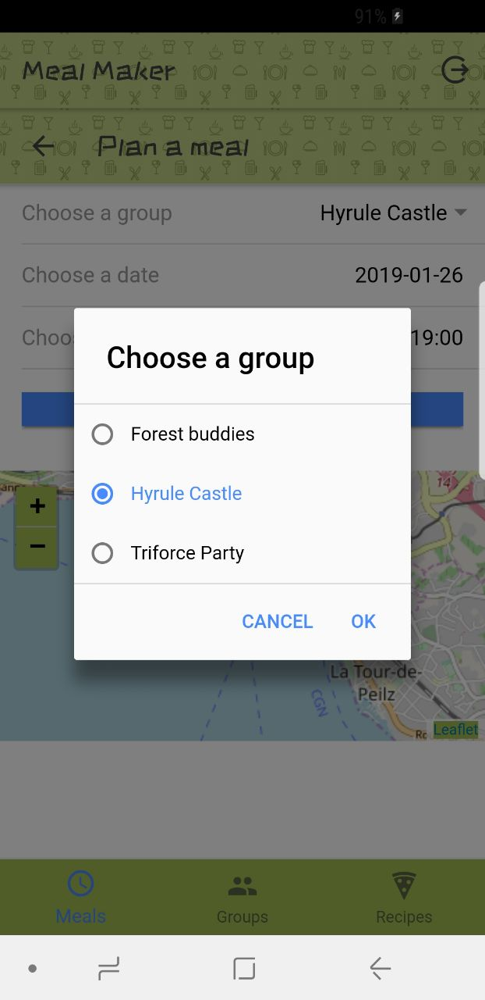
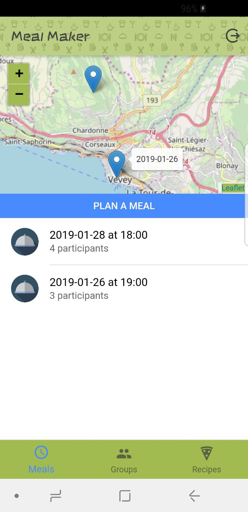

# MealMaker Mobile App 1.0.0

## What's MealMaker?

MealMaker helps you organize your meals with your family and friends.

- Register for free!
- Browse recipes that other users wrote, or create one yourself
- Create groups, then add members and recipes to them
- Rate recipes according to how healthy they are and how much you like them
- Organize a meal with members of your groups
- The recipe matcher finds the best recipes for the meal according to their ratings
- Enjoy!

## Gallery

| Free registration!  | Create groups with your friends and family |
| ------------- | ------------- |
|   |   |

| Browse other people's recipes  | Add users and recipes to your groups  |
| ------------- | ------------- |
|   |   |

| Plan meals with them  | See your next meals on the map  |
| ------------- | ------------- |
|   |   |

## Developer stuff
To lauch the app in your browser:

`ionic serve`

To launch the app on a phone:

`ionic cordova run android --device`
